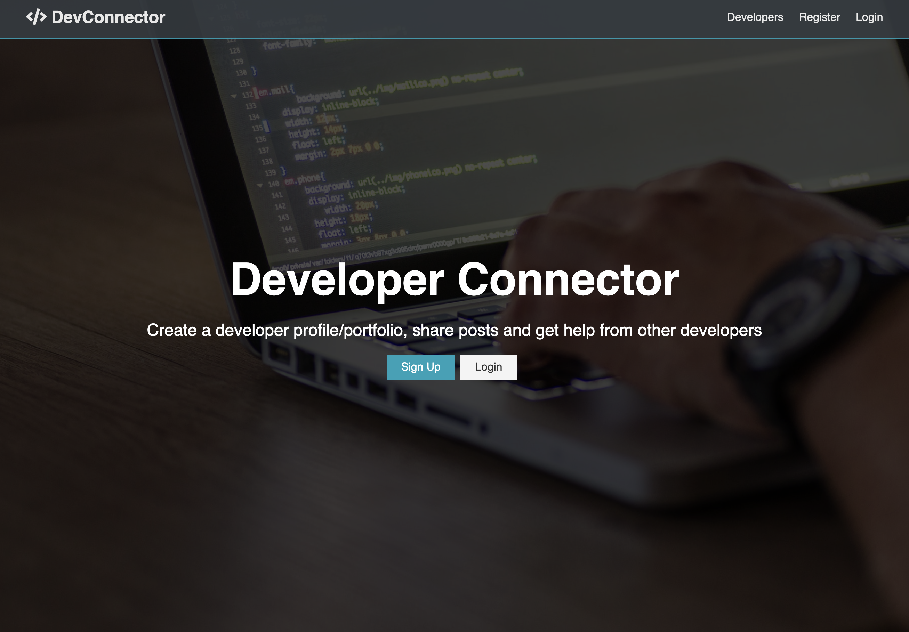
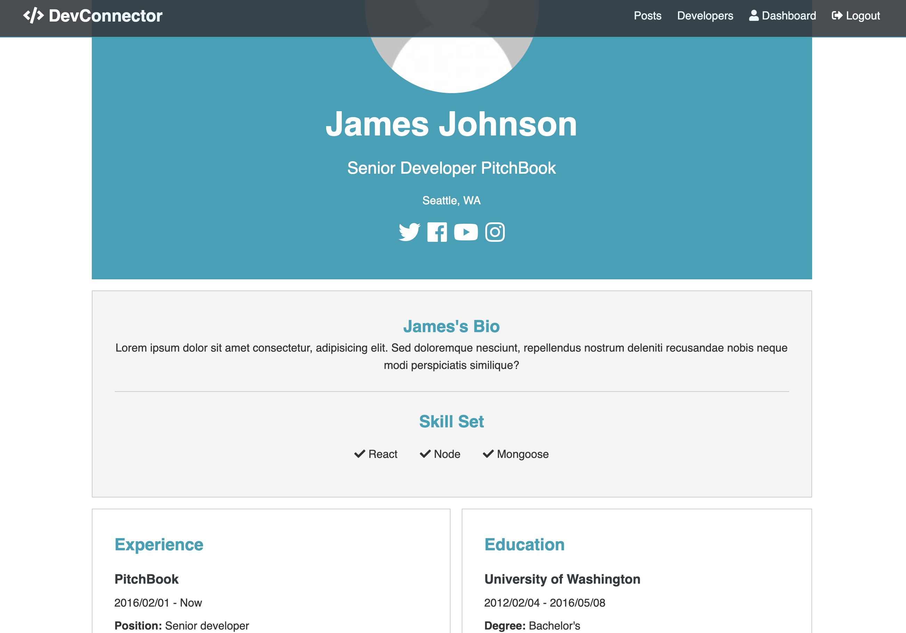
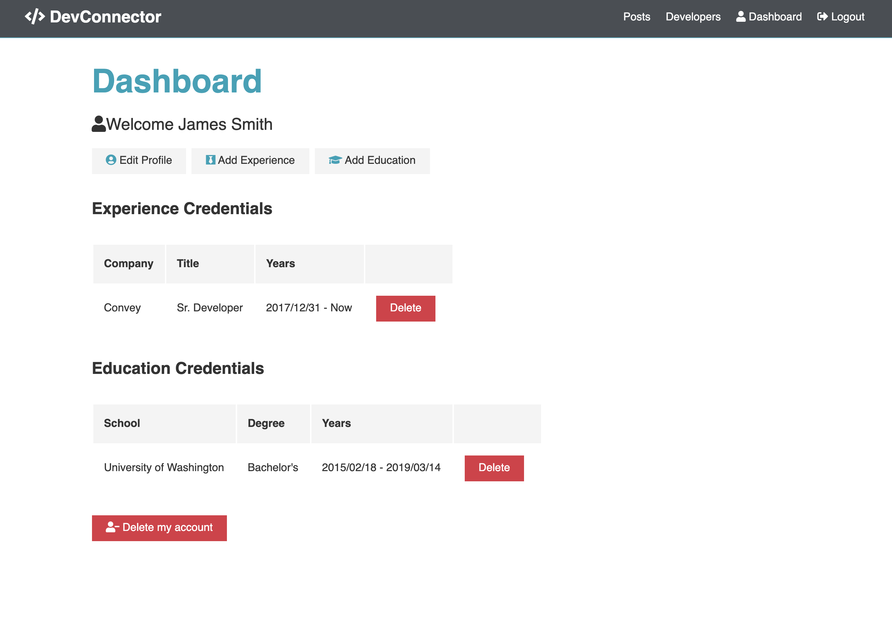
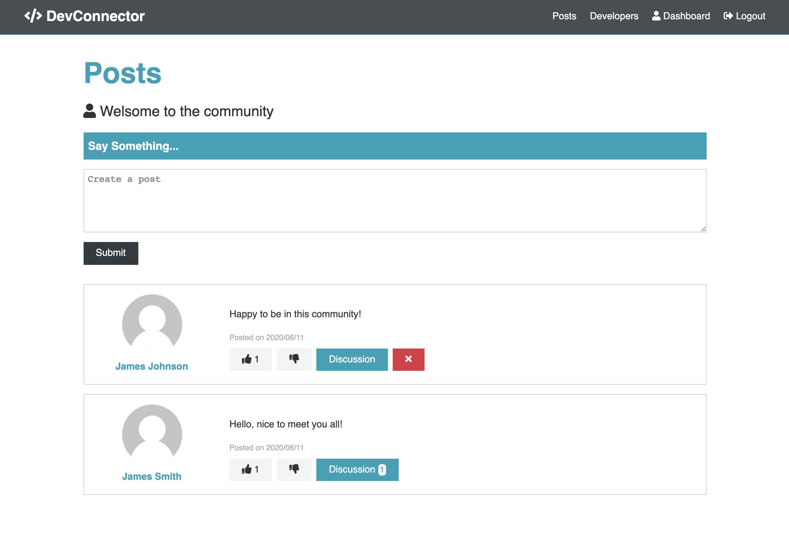
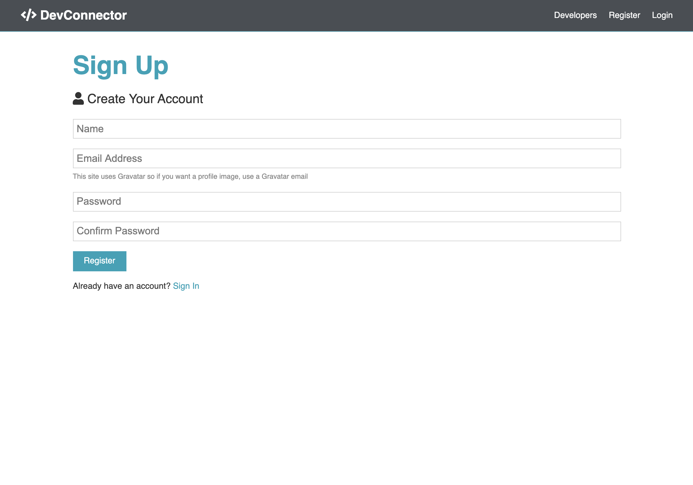
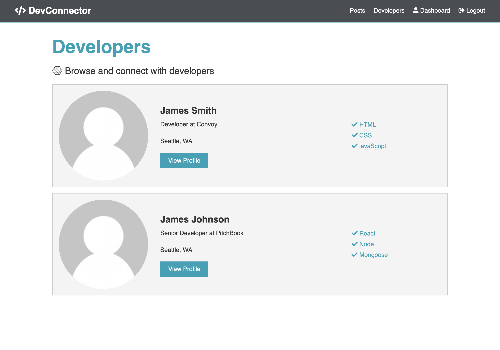

# DevConnector

## Fullstack Social network platform for developers with CRUD functionalities and authentication.

### Front end built with React functional components with hooks, state management with redux and thunk. Backend built with node/express, mongoDB/mongoose. Deployed on Heroku.

---

**Current Features:**
- A User is able to login / signup
- A User is able to browse others' profiles
- An authenticated user is able to create a profile via dashboard
- An authenticated user is able to update, delete profile via dashboard
- An authenticated user is able to create, comment on, like, and unlike posts
- An authenticated user is able to delete own posts and comments

---

[Live demo](https://mysterious-wildwood-60675.herokuapp.com/)

---

## SHOWCASE:

### Landing page

### Profile Page

### Dashboard page

### Posts page

### Signup page

### Browsing dev profiles
